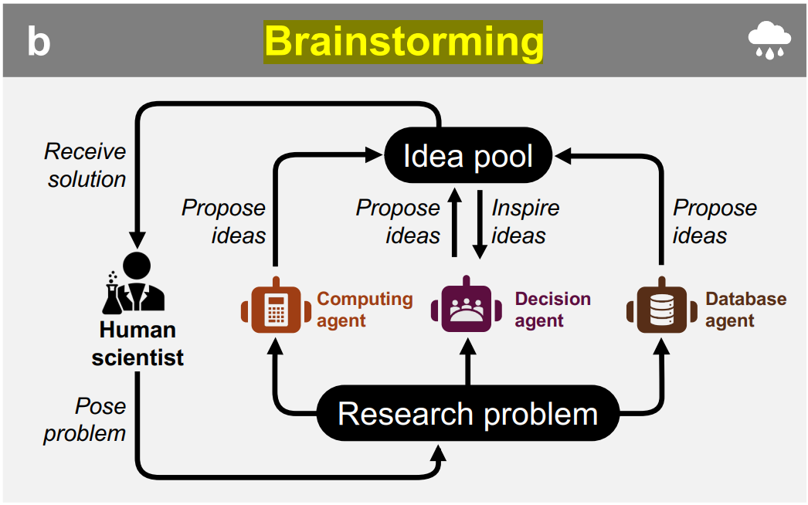
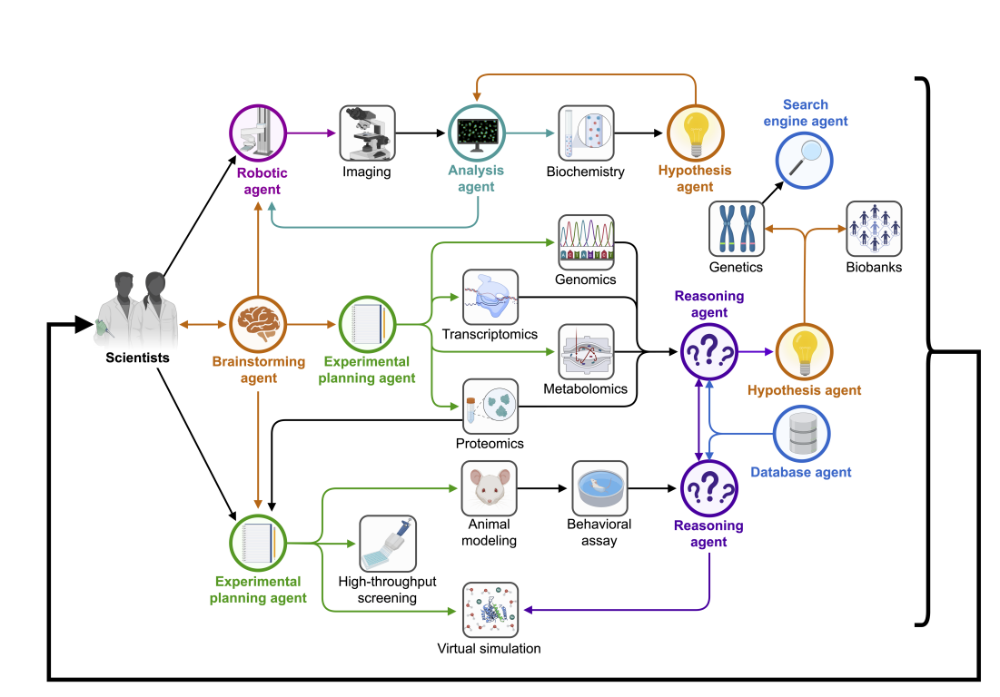

<!--
 * @Author: hibana2077 hibana2077@gmail.com
 * @Date: 2024-04-08 22:19:03
 * @LastEditors: hibana2077 hibana2077@gmail.com
 * @LastEditTime: 2024-04-08 22:27:08
 * @FilePath: \llm_agent_flow_lab\lab\brain_stroming\note.md
 * @Description: 这是默认设置,请设置`customMade`, 打开koroFileHeader查看配置 进行设置: https://github.com/OBKoro1/koro1FileHeader/wiki/%E9%85%8D%E7%BD%AE
-->
# Brainstorming Agent

## Goal

> Brainstorming agent, AI agent that generates a broad spectrum of research ideas;

> Brainstorming agents (Figure 3b). Brainstorming research ideas with multiple agents constitutes a collaborative session to generate a broad spectrum of research concepts through the joint expertise of scientists
and agents. In such sessions, agents are prompted to contribute ideas, prioritizing the volume of contributions over their initial quality to foster creativity and innovation. This method encourages the proposal of
unconventional and novel ideas, allowing participants to build upon the suggestions of others to uncover new
avenues of inquiry while withholding judgment or critique. The process enables agents to apply their domain
knowledge and resources to form a collective idea pool. This pool can then be distilled and examined more
thoroughly. To foster divergent thinking and creativity, it can be beneficial for agents to specialize in areas
of biology, for instance, microglia biology, neuronal degeneration, and neuroinflammation in the case of a
multi-agent system for Alzheimer’s.